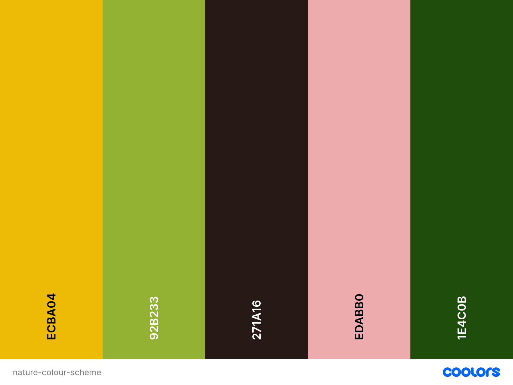

# Bee-Aware

Welcome to pollinator awareness website.

This page offers free tools to help you understand more about our many pollinators and what you can do to support them, along with details about our activities and campaigns.

Users can subscribe to newsletter and contact campaign managers directly.

# Contents

# User Experience - UX

## User Goals

- Valuable and trustworthy content.
- User-friendly navigation.
- Visually attractive images and layout.
- Contact form for content manager.
- List of events.
- Newsletter subscription.

## User Stories

- As a user, I want the information to be resented in a easy to follow format.
- As a user, I want navigation to be intuitive.
- As a user, I want to be able to use website on range of devices.
- As a user, I want the information on the website to be factual and purposeful.
- As a user, I want to be able to use the website a resource for ideas regarding the pollinators.
- As a user, I want the images to be relevant to the content of the website.
- As a user, I want to be able to subscribe to a monthly newsletter with actions I can take that month.
- As a user, I want to be able to easily contact content creators for feedback or changes.
- As a user, I want to be able to connect on social media to spread awareness.

## Website Goals and Objectives

- Raise pollinator awareness amongst the general public.
- Provide useful and accurate information that entices user to spend time on website.
- Present ideas easy to implement for pollinator welfare.
- Up-to-date events and action according to the season.
- Offer option to contact the content manager.
- Increase overall website traffic by increasing rankings on search engine.
- Increase newsletter subscribers.
- Acknowledge subscriptions and contact forms submissions.
- Open social media links in new tabs.
- Invite users to engage in social media activities.

[Back to top](#contents)

## Design Choices

### Typography

The font family chosen for Bee-Aware was Montserrat. This font has a high readability and makes the design look clean and simple.

### Colour Scheme

The color scheme was used based on pollinator and plant colours. Neutral off white was chosen for backgrounds. Main accent color is saffron yellow and together with liquerish brown represent the bee. The combination of greens and pale red used throughout the website in various shades for more nature inspired looks.

I have also used contrast-grid.eightshapes.com to get inspiration for possible colour combination to make the website visually attractive.

### Logo and Images
