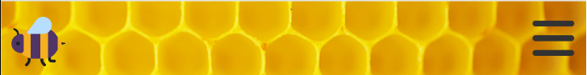
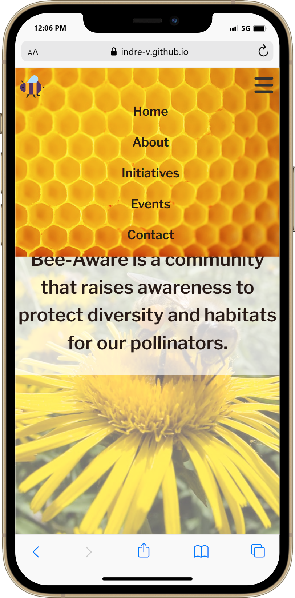
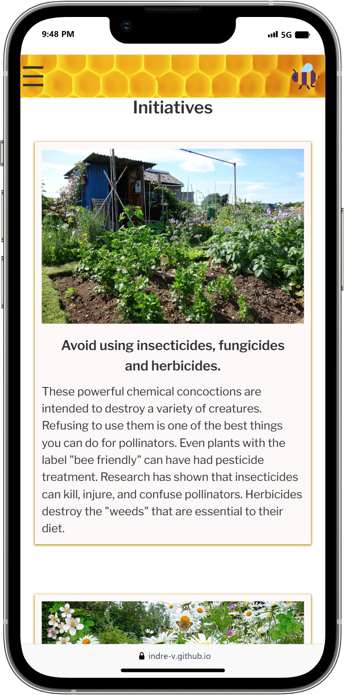
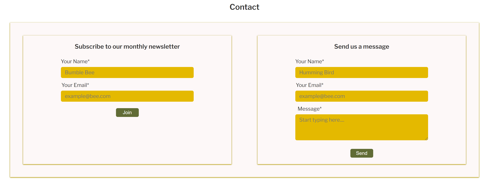
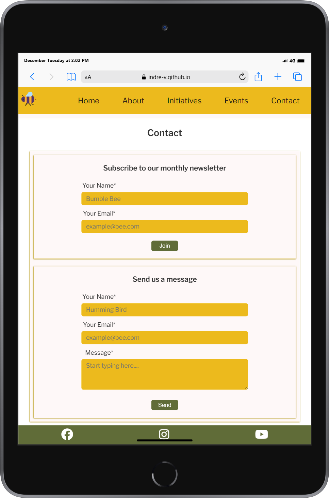

# Bee-Aware

[Link to Live Website](https://indre-v.github.io/bee-aware/)

Welcome to pollinator awareness website.

This page offers free information to help you understand more about our many pollinators and what you can do to support them, along with details about our activities and campaigns.

Users can subscribe to newsletter and contact campaign managers directly.

# Contents

- [Bee-Aware](#bee-aware)
- [Contents](#contents)
  - [User Goals](#user-goals)
  - [User Stories](#user-stories)
  - [Website Goals and Objectives](#website-goals-and-objectives)
  - [Wireframes](#wireframes)
    - [Mobile and Desktop Wireframes](#mobile-and-desktop-wireframes)
  - [Design Choices](#design-choices)
    - [Typography](#typography)
    - [Colour Scheme](#colour-scheme)
    - [Logo and Images](#logo-and-images)
    - [Structure](#structure)
- [Features](#features)
  - [Existing Features](#existing-features)
    - [Navigation Bar](#navigation-bar)
    - [Landing Page](#landing-page)
    - [About Section](#about-section)
    - [Initiatives](#initiatives)
    - [Events](#events)
    - [Contact](#contact)
    - [Footer](#footer)
  - [Future Enhancements](#future-enhancements)
- [Technologies Used](#technologies-used)
  - [Languages](#languages)
  - [Libraries \& Framework](#libraries--framework)
  - [Tools](#tools)
- [Testing](#testing)
  - [Responsiveness Tests](#responsiveness-tests)

## User Goals

- Valuable and trustworthy content.
- User-friendly navigation.
- Visually attractive images and layout.
- Contact form for content manager.
- List of events.
- Newsletter subscription.

## User Stories

- As a user, I want the information to be resented in a easy to follow format.
- As a user, I want navigation to be intuitive.
- As a user, I want to be able to use website on range of devices.
- As a user, I want the information on the website to be factual and purposeful.
- As a user, I want to be able to use the website a resource for ideas regarding the pollinators.
- As a user, I want the images to be relevant to the content of the website.
- As a user, I want to be able to subscribe to a monthly newsletter with actions I can take that month.
- As a user, I want to be able to easily contact content creators for feedback or changes.
- As a user, I want to be able to connect on social media to spread awareness.

## Website Goals and Objectives

- Raise pollinator awareness amongst the general public.
- Provide useful and accurate information that entices user to spend time on website.
- Present ideas easy to implement for pollinator welfare.
- Up-to-date events and action according to the season.
- Offer option to contact the content manager.
- Increase overall website traffic by increasing rankings on search engine.
- Increase newsletter subscribers.
- Acknowledge subscriptions and contact forms submissions.
- Open social media links in new tabs.
- Invite users to engage in social media activities.

[Back to top](#contents)

## Wireframes

Wireframes for the website were made using Balsamiq tool. Keeping in mind mobile first approach, wireframe for mobile was designed first. Naturally there is some deviation from wireframes in the live version of the website to accommodate the content. As the information is laid out in a logical sequence, the decision was made to have one-page website to enhance the end user experience.

### [Mobile and Desktop Wireframes](docs/mobile-desktop-wireframes.pdf "Mobile and Desktop Wireframes")

## Design Choices

### Typography

- The font family chosen for Bee-Aware was 'Libre Franklin'. This font has a high readability and makes the design look clean and simple.

### Colour Scheme

- The color scheme was used based on pollinator and plant colours. Neutral pale red was chosen for backgrounds. Main accent color is saffron yellow and together with liquerish brown represent the bee. The combination of green and yellow used throughout the website in various shades for more nature inspired looks.

- I have also used contrast-grid.eightshapes.com to get inspiration for possible colour combination to make the website visually attractive.

- CSS HEX
  --saffron: #ecba04ff;
  --tea-rose-red: #efbeb7ff;
  --dark-moss-green: #606c38ff;
  --licorice: #271a16ff;

### Logo and Images

### Structure

- My website will be responsiveto different layouts depending on the size of the viewport have been included in the CSS media queries. the breakpoints I am using are from Bootstrap.
  

\
&nbsp;
[Back to Top](#contents)
\
&nbsp;

# Features

- Bee-Aware aims to simplify information availability for users as much as possible. Layout  is easy to use and adhere to best practices in formatting and styling. The site's flow and appearance will be recognizable to users. Browsing of the entire website is encouraged by the relatable and easy to understand material.

## Existing Features

### Navigation Bar

- This webpage has navigation bar which is responsive to different screen sizes. It includes the logo of the bee which leads back to the home page.

  - Desktop (>=992px)

- The navigation bar is spread out the full width of the device with all link to different sections of the webpage. Navigation bar is fixed so it is present while browsing the page. It also has a shade of liquorish brown for :hover effect to improve user experience.

- Small devices (<768px)
  - For small devices, the desktop navigation bar is not user friendly. For this reason, it is coded to wrap into hamburger style icon. Once user clicks on the icon, the navigation options spread across the screen of the mobile device.

- Once user taps on the icon, the navigation options spread across the screen of the mobile device.

\
&nbsp;
[Back to Top](#contents)
\
&nbsp;

### Landing Page

- Bee-Aware landing page serves as a primary homepage. The landing page's objectives are to explain to the visitor the aim of the website in one sentence. Also it invites them to explore the site further using the navigation bar. The image has a faint overlay aith the box for the hero text as it makes introductory paragraph legible for better UX.

- The second part of the home page is the list of pollinators with the background color. The content layout is very simple and self explanatory. This part intends to educate the user and encourage them to continue reading other parts of the webpage.

\
&nbsp;
[Back to Top](#contents)
\
&nbsp;

### About Section

- This section contains information about the importance and issues pollinators face. The images chosen reflect the contents of the section. On the larger screens (>=992px), About section has two columns. On the right side, there is an eye catching image and on the left side I have included a consolidated version of the value pollinators provide to humans and nature. I kept the information as brief as possible in order to keep the end-users attention. Content is broken down into small paragraphs so the user can understand it better.

- The second row of the About section has the opposite layout for visual and contextual purposes. I aimed to highlight the Importance vs Issues using the flexbox layout of the section.

![About Section] (docs/about-second-row.png)

- For the smaller screen sizes (<992px), side by side image and text layout does not work so I have changed flex direction from row to column. It displays image first and text under which allows the content to be spaced out better to fit smaller screen sizes without looking too crowded.

\
&nbsp;
[Back to Top](#contents)
\
&nbsp;

### Initiatives

- Logical layout is one of my design goals for this website. After outlining importance and issues to the end user, I am now suggesting action in the Initiatives section. I have only included four actions/initiatives with relevant images and explanations in order not to overwhelm the end user with excessive information.

  - On the larger screens (>=992px), the Initiatives section is displayed using grid in two columns. Each initiative has a saffron yellow border and tea rose background to match the theme of the website. If end user is only browsing the website, initiative has an h3 heading to summarise the main point.

- To continue with the consistent appearance of the webpage, the initiative boxes a displayed in one column on the smaller screens. The inside of each card has the same layout as in the larger screen.

\
&nbsp;
[Back to Top](#contents)
\
&nbsp;

### Events

- This section contains the vents throughout the year end-user may be interested take part in. The colours are used in the layout are yellow and green to represent the pollinators and nature. The border colors are the same as in the previous section.

  _Large and Medium devices_ have title of the event displayed on the box with heading at the top and details below.

_Small Screen devices_ have title and details displayed in one column just like other sections. The details part would have been illegible otherwise.

\
&nbsp;
[Back to Top](#contents)
\
&nbsp;

### Contact

- The contact section has two parts in one box. For visual purposes, the same shadow as other boxes is coded around the border. The end-user can send a message or subscribe to the newsletter. All text fields are required and would not all user to subscribe or send otherwise. The email field is validated as well. Larger view screen have subscription and message parts display in on one row. For small screens, they are displayed in one column just like other all the other sections in small screen.

- When end-user clicks the button to either join or send, the applicable page for one of two actions is displayed. the pages contains a thank you message with the logo for large screen and home icon in green and turns yellow when hovered which brings the user back to the homepage.

\
&nbsp;
[Back to Top](#contents)
\
&nbsp;

### Footer

- Moss green color is used throughout the elements of the webpage is continued to the footer as a background. Footer includes the links to social media which are coded to open in a separate tab. The three links are spread across the bottom of the page. A hover effect which is saffron yellow sames in contact section is added to enhance user experience.

## Future Enhancements

- An e-commerce element where users may buy pesticides and seeds that are friendly to pollinators could be added.
- A separate blog page or the entire blog could be added on navigation bar. It would be beneficial to provide users with up-to-date news. Additional content, such as articles and videos, may be shown here.
- It would be beneficial to have embedded maps for each event that don't require off-page navigation, since this would facilitate finding the events nearby and improve user experience.
- A gallery of end user pollinator friendly gardens.

# Technologies Used

## Languages

- [HTML5](https://developer.mozilla.org/en-US/docs/Glossary/HTML5 "HTML")
- [CSS3](https://developer.mozilla.org/en-US/docs/Web/CSS "CSS")

## Libraries & Framework

- [Google Fonts](https://fonts.google.com/ "Google Fonts")
- [Font Awesome library](https://fontawesome.com/ "Font Awesome")

## Tools

- [Codeanywhere](https://app.codeanywhere.com/ "Codeanywhere")
- [GitHub](https://github.com/ "GitHub")
- [Balsamiq](https://balsamiq.com/wireframes/ "Balsamiq")
- [Coolors](https://coolors.co/ "Coolors")
- [Contrast Grid](https://contrast-grid.eightshapes.com/ "Contrast Grid")
- [Gencraft](https://gencraft.com/generate/ "Gencraft")
- [W3C HTML Validation Service](https://validator.w3.org/ "W3C HTML")
- [W3C CSS Validation Service](https://jigsaw.w3.org/css-validator/ "W3C CSS")
- [Bootstrap](https://getbootstrap.com "Bootstrap")
- [Slack](https://www.icloud.com/notes/ "Slack")
- [TOC Generator](https://ecotrust-canada.github.io/markdown-toc/ "TOC Generator")
- [Am I Responsive](https://ui.dev/amiresponsive "Am I responsive")
- [Responsive Design Checker](https://responsivedesignchecker.com/ "Responsive Design Checker")

\
&nbsp;
[Back to Top](#table-of-contents)
\
&nbsp;

# Testing 

## Responsiveness Tests

I have deployed the project a very early stage in order to test the responsivenes. I have used mobile first approach and checked all my changes on Microsoft Edge and Google Chrome browser DevTools. External website - [Responsive Design Checker](https://responsivedesignchecker.com/ "Responsive Design Checker") was used to test deployed versions. Another external source used was [Responsive Design Checker](https://responsivedesignchecker.com/ "Responsive Design Checker") website to get a single view of various device breakpoints. 

 

